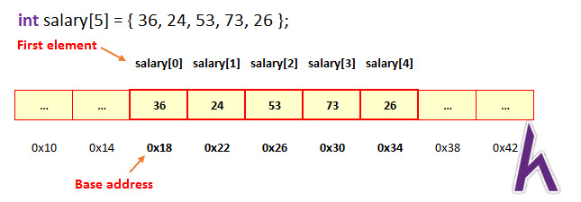

# Mảng 1 chiều

_Written by Luong Tuan Anh_

### VẤN ĐỀ ĐẶT RA

> Giả sử, ta cần tạo một chương trình lưu trữ điểm môn Giải tích các sinh viên PTIT:

- Với số sinh viên = 2, ta sẽ cần khai báo : `student1, student2;`
- Với số sinh viên = 3, ta phải khai báo 3 biến `student1, student2, student3`
- Nhưng số sinh viên quá lớn thì sao?

## Một ví dụ khác liên quan tới bài tập

#### Giả sử cho bài toán như sau sau:

> Nhập vào một dãy gồm 5 phần tử có giá trị <=10^9, sau đó in ra dãy đảo ngược của nó

<details>
<summary>Code </summary>

```cpp
#include <stdio.h>
int main(){
    int a,b,c,d,e; //tạo 5 biến để lưu 5 số
    scanf("%d %d %d %d %d",&a,&b,&c,&d,&e);
    printf("%d %d %d %d %d",e,d,c,b,a);
}
```

</details>

---

<details>
<summary> Problems </summary>
Nhưng giả dụ, bài toán không dừng lại ở 5 số, mà 100 số, 1000 số thì sao ?

Bạn nghĩ tới việc tạo 100 biến, 1000 biến để lưu trữ chúng?

</details>

## MẢNG LÀ GÌ?

<details>
<summary>Khái niệm </summary>
</br>
<code> Mảng là cách gọi của một tập hợp biến có cùng kiểu dữ liệu, lưu trữ dữ liệu trong các ô nhớ liên tiếp nhau... Kích thước của mảng được xác định ngay khi khai báo và không thể thay đổi. </code>

Như chúng ta đã biết, mỗi biến đều có 1 ô nhớ (với 1 địa chỉ để định danh)

Vậy khi ta tạo một mảng, tức là yêu cầu máy tính cấp phát 1 vùng bộ nhớ liên tục, để lưu các giá trị



Trên ảnh, thấy rõ, các phần tử trong mảng được xếp liên tiếp nhau, địa chỉ của phần tử sau sẽ bằng phàn tử trước cộng thêm `sizeof(kiểu dữ liệu của mảng)`

</details>

## Khai báo và cú pháp

Cú pháp khai báo :

` <kiểu dữ liệu> tên_biến[số phần tử ];`

Ví dụ :

```cpp
int array[5]; //tạo ra một mảng lưu trữ 5 phần tử
```

hoặc có thể khởi tạo mảng với dữ liệu có sẵn mà không cần khai báo số phần tử `(*)`

```cpp
int array[] = {1,2,3,4,5,6,7} //mảng gồm 7 phần tử
```

#### Một số lưu ý khi sử dụng mảng:

- Phải khai báo số phần tử cho mảng nếu không cung cấp giá trị sẵn `(*)`
- Chỉ số của mảng ( phần nằm trong dấu `[]`) bắt đầu từ số 0 ( **không phải từ 1** )
- Khi sử dụng mảng sẽ tốn `số phần tử * sizeof(1 phần tử bất kì trong mảng `
- Giá trị ban đầu khi khởi tạo mảng sẽ là giá trị rác

> Nhắc lại : `sizeof(biến)` là hàm trả về kích cỡ của một biến

## Tạo mảng bằng cách cấp phát bộ nhớ

Với cách này, yêu cầu có kiến thức căn bản về con trỏ, sẽ không nhắc đến tại bài này :>

- `Malloc:`

  > Hàm malloc (memory allocation) được sử dụng để cấp phát một phần bộ nhớ liên tục cho mảng.

- Sử dụng hàm malloc để tạo mảng :

```cpp
int *arr;
arr = (int *)malloc(n * sizeof(int)); //tạo mảng gồm n phần tử có kiểu dữ liệu là int
```

Lưu ý :

- Mảng tạo bằng malloc sẽ tương tự như cách khai báo mảng thông thường, giá trị của mảng sẽ chứa giá trị rác khi khởi tạo
- Để sử dụng hàm này, cần `#include <cstdlib>`

---

- `Calloc` :
  > Hàm `calloc` tương tự như hàm `malloc`, chỉ khác là khi cấp phát bộ nhớ thành công, sẽ đặt mặc định giá trị là 0 thay vì là giá trị rác

```cpp
int *arr_calloc = (int *)calloc(5, sizeof(int));
```

## Sử dụng mảng

### Nhập giá trị cho mảng bằng `scanf`

Nhập xuất như một biến bình thuờng...

```cpp
int arr[10];
scanf("%d",&arr[0]);

printf(arr[0]);
```

Lưu ý rằng :

**Không thể nhập hoăc xuất giá trị trực tiếp cho mảng, cần sử dụng vòng lặp để nhập từng giá trị cho mỗi phần tử của mảng**

```cpp
int arr[10];
for(int i=0;i<10;i++){
    printf("Hãy nhập giá trị cho phần tử %d:",i);
    scanf("%d",&arr[i]);
}

// in ra
for(int i=0;i<10;i++){
    printf("%d",arr[i]);
}
```

<details>
<summary> Output </summary>
<video controls="control" width="100%" height="100%">
    <source src="output.mov" type="video/mp4">
</video>
</details>

### TIPS SỬ DỤNG MẢNG :

Khi khai bảo mảng ở ngoài main như thế này :

```cpp
int arr[10000];
int main(){
    printf("%d",arr[0]);
    //output : 0
}
```

Giá trị của mảng sẽ mặc định bằng 0 thay vì gía trị rác
